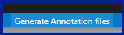

# Package Manager Tools

Package Manager Tools is a VS Code extension that adds a suite of tools to help with package managers, npm packages and package.json files.

## Features

### Package Manager Buttons:

#### Buttons to switch between package managers

#### Buttons to manage installed [npm](https://www.npmjs.com/) packages:
* Install all packages
* Install specific package
* Remove specific package
* List all packages

#### Button to get package manager's currently installed version:

### Annotations
#### Add user defined annotations to *package.json* file scripts
Annotations are stored in a *package.annotations.json* file in the same directory as the *package.json* file.

The schema for the *package.annotations.json* file is the same as the [package.json](https://docs.npmjs.com/cli/v7/configuring-npm/package-json) file's "scripts" section.

Any entry in the *package.annotations.json* file that matches a script in the *package.json* file will be displayed in the *package.json* file as an annotation:
 

 

You can create *package.annotations.json* files manually or you can use the Annotations Generator to create an annotation file for every *package.json* file in your workspace.
 

#### **Note: [`Editor Code Lens`](vscode://settings/editor.codeLens) must be enabled in VS Code settings for the annotations to appear.**

### Other Tools:

#### Buttons to automatically bump the version of the app:

#### Button to toggle the terminal:

## Settings

### `"PackageManagerTools.hideMissingAnnotationsWarning"`
This setting hides the *'missing annotations'* status bar warning.
* Options: `true` OR `false`
* _Default: `false`_

### `"PackageManagerTools.hideGenerateAnnotationsButton"`
This setting hides the *Generate Annotations* status bar button.
* Options: `true` OR `false`
* _Default: `false`_