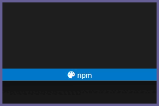
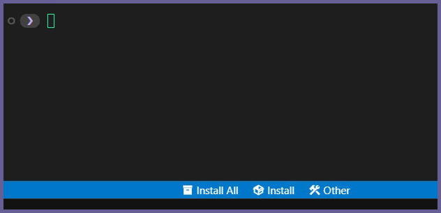
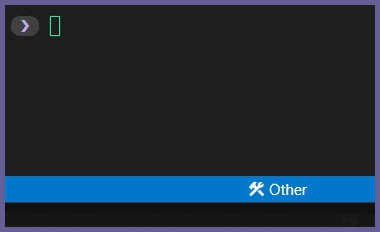
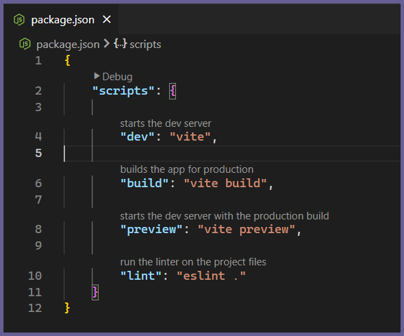
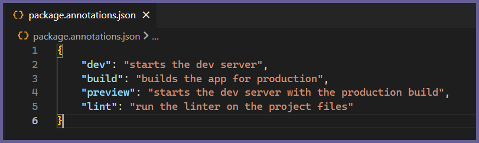
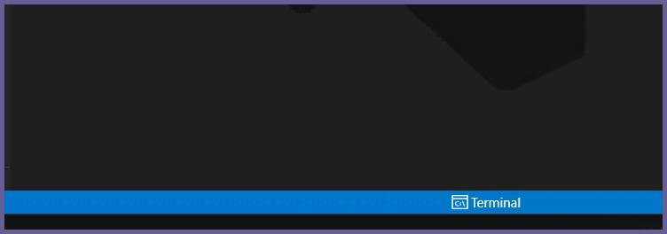

<h1 align="center">
	 
	
	  
	Package Manager Tools
	  
</h1>

Package Manager Tools is a VS Code extension that adds a suite of tools to help with package managers, npm packages and package.json files.

<h2>Table of Contents</h2>

<ul>
	<li>
		<a href="#features">Features</a>
		<ul>
			<li><a href="#packageManagerButtons">Package Manager Buttons</a></li>
			<li><a href="#annotations">Annotations</a></li>
			<li><a href="#otherTools">Other Tools</a></li>
		</ul>
	</li>
	<li><a href="#settings">Settings</a></li>
	<li><a href="#changelog">Changelog</a></li>
	<li><a href="#related">Related</a></li>
</ul>

<h2 id="features">Features</h2>

<h3 id="packageManagerButtons">Package Manager Buttons</h3>

<h4>Buttons to select which package manager to use for the current workspace</h4>

<h4>Buttons to manage installed <a href="https://www.npmjs.com/">npm</a> packages:</h4>
<ul>
	<li>Install all/specific package(s)</li>
	<li>Remove specific package(s)</li>
	<li>List all packages</li>
</ul>

<h4>Button to get package manager's currently installed version:</h4>

<h3 id="annotations">Annotations</h3>

<h4>Add user defined annotations to <i>package.json</i> file scripts</h4>

 
Annotations are stored in a <i>package.annotations.json</i> file in the same directory as the <i>package.json</i> file.

The schema for the <i>package.annotations.json</i> file is the same as the [package.json](https://docs.npmjs.com/cli/v7/configuring-npm/package-json) file's "scripts" section.

Any entry in the <i>package.annotations.json</i> file that matches a script in the <i>package.json</i> file will be displayed in the <i>package.json</i> file as an annotation:

 

You can create <i>package.annotations.json</i> files manually or you can use the Annotations Generator to create an annotation file for every <i>package.json</i> file in your workspace.
 

<blockquote>
	<h4>
		<b>
			Note: <a href="vscode://settings/editor.codeLens/"><code>Editor Code Lens</code></a> must be enabled in VS Code settings for the annotations to appear.
		</b>
	</h4>
</blockquote>

<h3 id="otherTools">Other Tools</h3>

<h4>Buttons to automatically bump the version of the app:</h4>

<h4>Button to toggle the terminal:</h4>

<h2 id="settings">Settings</h2>

<table>
	<thead>
		<tr>
			<th>Name</th>
			<th>Description</th>
			<th>Options</th>
		</tr>
	</thead>
	<tbody>
		<tr>
			<td><code>PackageManagerTools.packageManager</code></td>
			<td>The Package Manager to use when running npm package commands.</td>
			<td>
				<code>npm</code><i>(default)</i> 
				<code>pnpm</code> 
				<code>bun</code>
			</td>
		</tr>
		<tr>
			<td><code>PackageManagerTools.buttonLabels</code></td>
			<td>Determines how the status bar button labels should be displayed.</td>
			<td>
				<code>icons</code> 
				<code>text</code> 
				<code>both</code><i>(default)</i>
			</td>
		</tr>
		<tr>
			<td><code>PackageManagerTools.hideMissingAnnotationsWarning</code></td>
			<td>Hides the <b>Generate Annotations</b> status bar warning button.</td>
			<td>
				<code>true</code> 
				<code>false</code><i>(default)</i>
			</td>
		</tr>
		<tr>
			<td><code>PackageManagerTools.hideTerminalButton</code></td>
			<td>Hides the <b>Terminal</b> status bar button.</td>
			<td>
				<code>true</code> 
				<code>false</code><i>(default)</i>
			</td>
		</tr>
		<tr>
			<td><code>PackageManagerTools.hidePackageManagerButton</code></td>
			<td>Hides the <b>Package Manager Switcher</b> status bar button.</td>
			<td>
				<code>true</code> 
				<code>false</code><i>(default)</i>
			</td>
		</tr>
		<tr>
			<td><code>PackageManagerTools.hideInstallAllButton</code></td>
			<td>Hides the <b>Install All</b> status bar button.</td>
			<td>
				<code>true</code> 
				<code>false</code><i>(default)</i>
			</td>
		</tr>
		<tr>
			<td><code>PackageManagerTools.hideInstallButton</code></td>
			<td>Hides the <b>Install</b> status bar button.</td>
			<td>
				<code>true</code> 
				<code>false</code><i>(default)</i>
			</td>
		</tr>
		<tr>
			<td><code>PackageManagerTools.hideRemoveButton</code></td>
			<td>Hides the <b>Remove Package</b> status bar submenu.</td>
			<td>
				<code>true</code> 
				<code>false</code><i>(default)</i>
			</td>
		</tr>
		<tr>
			<td><code>PackageManagerTools.hideListButton</code></td>
			<td>Hides the <b>List Packages</b> status bar submenu.</td>
			<td>
				<code>true</code> 
				<code>false</code><i>(default)</i>
			</td>
		</tr>
		<tr>
			<td><code>PackageManagerTools.hideVersionButton</code></td>
			<td>Hides the <b>Get Version</b> status bar submenu.</td>
			<td>
				<code>true</code> 
				<code>false</code><i>(default)</i>
			</td>
		</tr>
		<tr>
			<td><code>PackageManagerTools.hideUpdateVersionButton</code></td>
			<td>Hides the <b>Update App Version</b> status bar button.</td>
			<td>
				<code>true</code> 
				<code>false</code><i>(default)</i>
			</td>
		</tr>
	</tbody>
</table>

<h2 id="changelog">Changelog</h2>

See [CHANGELOG](CHANGELOG.md) for more information.

<h2 id="related">Related</h2>

<a href="https://github.com/zeru-t/vscode-extensions">Other VS Code extensions that I've created</a>